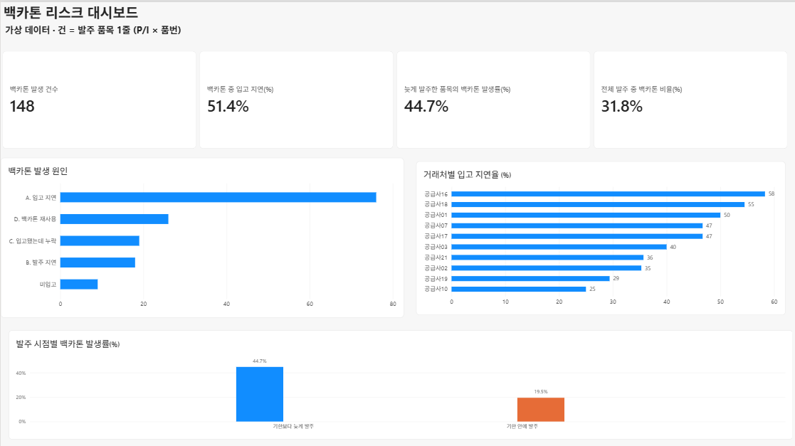
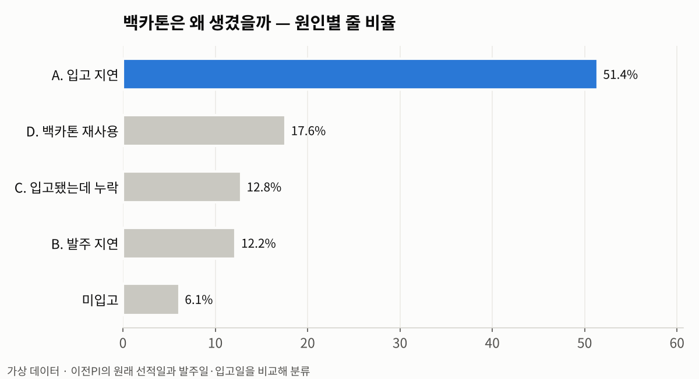
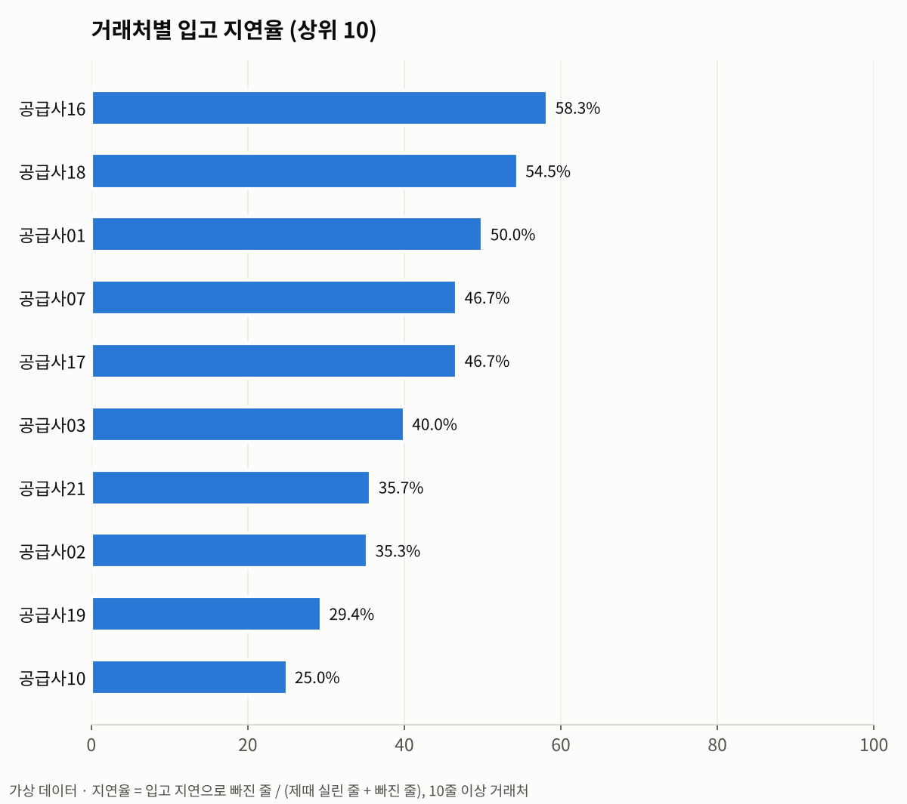
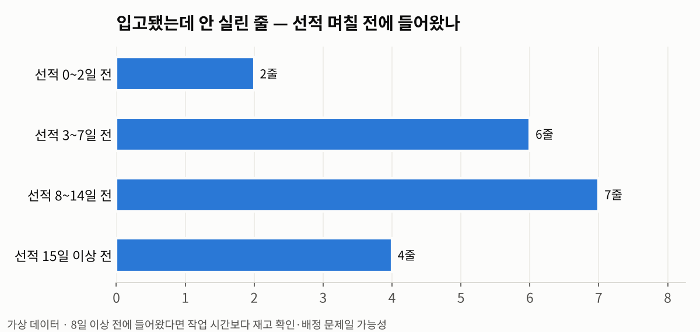
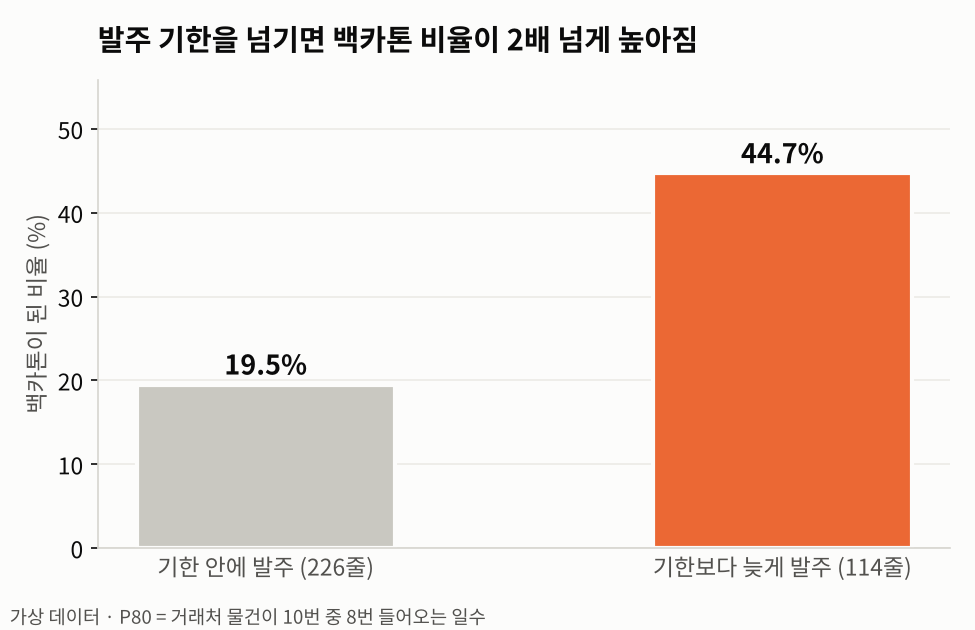

# 📦 SCM 재고관리 · 백카톤 리스크 분석 (SQL)

자동차 애프터마켓 부품 수출 회사의 **발주·입고·재고·선적 ERP 데이터**로
"선적에 못 실리고 다음 배로 넘어가는 물량(백카톤, Back Carton)"이 **왜 생기는지** 찾고,
**언제까지 얼마나 발주해야 하는지** 알려 주는 규칙을 SQL(SQLite)로 만든 프로젝트입니다.

> ⚠️ 이 저장소의 데이터는 **모두 가상 데이터**입니다.
> 실제 ERP 내보내기 파일과 **컬럼 구조만 같고**, 회사·거래처·바이어·품번·금액은 전부 만들어 낸 값입니다.
> 실제 데이터 분석은 사내에서만 진행했고 공개하지 않습니다.

| 보는 방법 | 링크 |
|---|---|
| 📓 분석 노트북 (SQL + 결과 + 차트) | [`notebooks/analysis.ipynb`](https://github.com/Gounig/scm-inventory-risk/blob/main/notebooks/analysis.ipynb) |
| 📊 대시보드 (Power BI) | [화면 보기](#power-bi-대시보드) · [`scm-dashboard.pbix`](scm-dashboard.pbix) |
| 🧪 브라우저에서 직접 SQL 실행 | [SQL 연습장 열기](https://gounig.github.io/scm-inventory-risk/docs/) |

---

## 1. 문제

- 바이어 오더가 들어오면 품목별로 발주 → 창고 입고 → 컨테이너 선적 순으로 진행됨
- 선적일까지 물건이 준비되지 않으면 해당 줄은 **백카톤(BC)** 으로 다음 선적에 넘어감
- 백카톤이 쌓이면 재고 증가, 바이어 납기 지연, 같은 품목 중복 구매로 이어짐
- 그런데 ERP에는 "왜 넘어갔는지"가 기록되지 않음 → 원인을 데이터로 다시 맞춰 봐야 함

## 2. 데이터 구조

| 테이블 | 원본 | 주요 컬럼 |
|---|---|---|
| `raw_order_lines` | 월별 발주·입고 내역 | 품번, P/I, 거래처, 발주일, 입고일, 수량, 단가, 이전PI, 원PI |
| `raw_inventory` | 재고 현황 | 품번, 재고수량, 배정수량, 잔여수량, 단가 |
| `raw_shipments` | 선적 실적 | P/I, 선적일(배가 떠난 날), 오더일, 금액, CBM |

`sql/01_schema.sql` 에 전체 컬럼이 있습니다.

## 3. 접근 방법

### 1단계 · 데이터 정리 (`02_clean.sql`)
- **품번 매칭 키**: 하이픈·공백·앞자리 0 때문에 같은 품번이 다르게 적힌 문제 해결
  `LTRIM(UPPER(REPLACE(REPLACE(TRIM(part_no),'-',''),' ','')),'0')`
- **줄 유형 분류**: P/I 와 이전PI 패턴으로 `신규 / 백카톤 이월 / 백오더 / 계획발주` 구분
- **백카톤 종류**: 창고에 있던 BC를 다시 배정한 줄(재사용) vs 새로 산 줄(재구매)

### 2단계 · 백카톤 원인 분류 (`03_bc_causes.sql`)
이전PI에서 `BC`를 떼면 **원래 실렸어야 할 선적**이 나옴 → 그 선적일과 발주일·입고일을 비교

| 원인 | 판단 기준 |
|---|---|
| A. 입고 지연 | 발주는 선적 전, 입고가 선적 후 |
| B. 발주 지연 | 선적이 끝난 뒤 발주 |
| C. 입고됐는데 누락 | 선적 전에 입고됐는데 안 실림 |
| D. 재사용 | 창고 BC를 다음 선적에 배정 |
| E / F | 원래 선적을 알 수 없음 (연도 BC, 기간 밖) |

거래처별 입고 지연율, C 유형의 입고 시점 분포도 함께 확인

### 3단계 · 발주 기한 + 권장 발주량 (`04_order_timing.sql`, `05_recommend.sql`)
- 거래처별 리드타임(발주→입고)의 **P80** = "10번 중 8번은 이 안에 들어온다"
  - 입고 20줄 미만 거래처는 전체 P80 사용, 자체 재고 배정 줄은 제외
- **발주 기한** = 선적 예정일 − P80 리드타임
- **권장 발주량** = MAX(오더 수량 − 잔여 재고, 0)
- **위험도**: 기한 초과 `높음` / 3일 이내 `중간` / 그 외 `낮음` / `재고로 충당`

## 4. 가상 데이터 결과 예시

> 가상 데이터는 규칙을 확인하려고 비율을 정해서 만든 값이라, 아래 숫자 자체에 의미는 없습니다.
> "이런 식으로 결과가 나온다"를 보여 주는 용도입니다.

### Power BI 대시보드

`data/exports/` 의 CSV 4개를 불러와 DAX 측정값(COUNTROWS · CALCULATE · DIVIDE)으로 만든 1페이지 대시보드

### 백카톤 원인 — 절반 이상이 입고 지연


### 거래처별 입고 지연율


### 입고됐는데 안 실린 줄 — 상당수가 선적 8일 이상 전에 입고

→ 작업 시간 부족보다 **재고 확인·배정** 문제 가능성

### 발주 기한 규칙 검증 — 기한을 넘기면 백카톤 비율 2배 이상


| 발주 시점 | 줄수 | 백카톤 비율 |
|---|---|---|
| 기한 안에 발주 | 226 | 19.5% |
| 기한보다 늦게 발주 | 114 | **44.7%** |

### 새 오더 권장 발주 예시 (`reorder_recommendation`)

| 품번 | 오더 | 잔여재고 | 권장발주 | P80 | 발주기한 | 위험도 |
|---|---|---|---|---|---|---|
| 64667109 | 80 | 120 | 0 | 18일 | 06-10 | 재고로 충당 |
| 95154-39627 | 150 | 97 | 53 | 18일 | 06-10 | 중간 |
| 0K19A-86-609 | 50 | 0 | 50 | 18일 | 06-07 | **높음** |
| 0K23A-10-586 | 30 | 0 | 30 | 18일 | 07-02 | 낮음 |

(검토일 2024-06-10 기준, 전체 과정은 노트북 3-③ 참고)

## 5. 해결 방안

### 원인별 해결 방법

| 원인 | 해결 방법 | 쓰는 SQL |
|---|---|---|
| A. 입고 지연 (51%) | 오더가 들어오면 거래처별 P80으로 **발주 기한**을 계산하고, 기한이 3일 남으면 `중간`, 넘으면 `높음`으로 알림 | `reorder_recommendation` |
| B. 발주 지연 (12%) | 선적일이 정해진 뒤 추가된 오더는 처음부터 `높음`으로 표시해 영업·바이어와 선적일을 다시 협의 | 같은 뷰 |
| C. 입고됐는데 누락 (13%) | 선적 일주일 전에 **입고 완료됐는데 아직 배정 안 된 품목** 목록을 뽑아 창고와 확인. 누락 19줄 중 11줄이 선적 8일 이상 전에 이미 들어와 있었음 | `bc_lines` 응용 |
| 중복 구매 | 발주 전에 **잔여 재고를 먼저 차감**하고 모자란 만큼만 발주 | `recommended_po_qty` |

### 업무 흐름 바꾸기

```
오더 접수 → ① 잔여 재고 차감 → ② 권장 발주량·발주 기한 확인
→ ③ 위험도 높음/중간이면 담당자 알림 → ④ 선적 7일 전 미배정 입고품 체크
```

### 기대 효과 (가상 데이터 기준 추정)

- 기한보다 늦게 발주한 114줄이 기한 안에 발주한 줄처럼 19.5%만 백카톤이 됐다면, 51줄이 22줄로 줄어요.
- 그러면 이 분석에서 다룬 백카톤 95줄 중 **약 30%(29줄)가 줄어요.**
- 가상 데이터라서 실제 숫자가 아니라 **이런 방식으로 효과를 추정한다**는 예시예요.

## 6. 실행 방법

```bash
pip install -r requirements.txt

# 가상 데이터 생성 → DB 적재 → 분석 1~5 출력
python scripts/run_all.py

python scripts/make_charts.py          # README 차트 → images/
python scripts/export_for_bi.py        # 대시보드용 CSV → data/exports/
python scripts/build_practice_page.py  # 연습장 → docs/index.html
```

**내 ERP 파일로 돌려 보기** (같은 형식의 엑셀이 있을 때)

```bash
python scripts/load_erp.py data/private private.db
```
- 파일 이름에 `발주` `입고` `실적` `재고` 가 들어가면 자동으로 해당 테이블에 적재
- 담당자 이름 등 개인정보 컬럼은 읽지 않음
- `data/private/`, `*.db` 는 `.gitignore` 로 업로드에서 제외

## 7. 폴더 구조

```
├── sql/                 # 01 스키마 → 05 권장 발주 (순서대로 실행)
├── scripts/
│   ├── generate_sample_data.py   # 가상 ERP 엑셀 생성
│   ├── load_erp.py               # 엑셀 → SQLite 적재
│   ├── run_all.py                # 전체 실행
│   ├── make_charts.py            # README 차트
│   ├── export_for_bi.py          # 대시보드용 CSV
│   └── build_practice_page.py    # 브라우저 연습장 생성
├── notebooks/analysis.ipynb      # 분석 노트북
├── images/              # 결과 차트
├── data/sample/         # 가상 데이터 (엑셀)
├── data/exports/        # 대시보드용 CSV
├── scm-dashboard.pbix   # Power BI 대시보드
├── dashboard.png        # 대시보드 캡처
├── web/template.html    # 연습장 템플릿
└── docs/
    ├── index.html       # SQL 연습장 (GitHub Pages)
    └── sql-asm.js       # 브라우저용 SQLite 엔진 (sql.js, MIT)
```

## 8. 한계와 다음 단계

- 재고 파일이 **추출 시점 한 장**뿐이라, 과거 특정 날짜의 재고를 정확히 알 수 없음
  → "재사용한 날 ±14일 안에 또 구매" 를 중복 구매 후보로 간접 추정
- 선적 예정일은 바이어·영업 협의로 정해지므로 입력값으로 받음
- 권장값은 참고용이며 최종 판단은 담당자가 함

## 기술 스택
SQLite 3 (View, CTE, Window Function) · Python (pandas, matplotlib, Jupyter) · Power BI · sql.js
